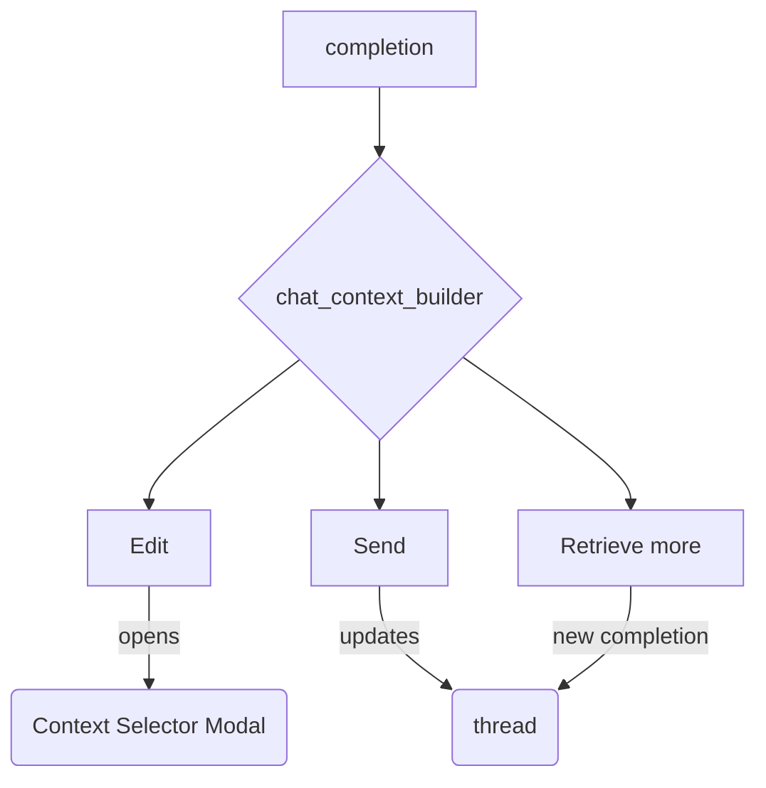

## Components API

### chat_context_builder.js

| Function | Description |
| --- | --- |
| `build_html(ctx, opts)` | Returns HTML markup for the context builder |
| `render(ctx, opts)` | Renders the markup and calls `post_process`. Adds chat controls like **Edit**, **Send**, and **Retrieve more**. |
| `post_process(ctx, container, opts)` | Attaches chat-specific behaviour to the builder element. |

### chat.js

| Function | Description |
| --- | --- |
| `rename_thread(collection, thread, new_name)` | Stores a friendly name in `data.name` and queues a save. |
