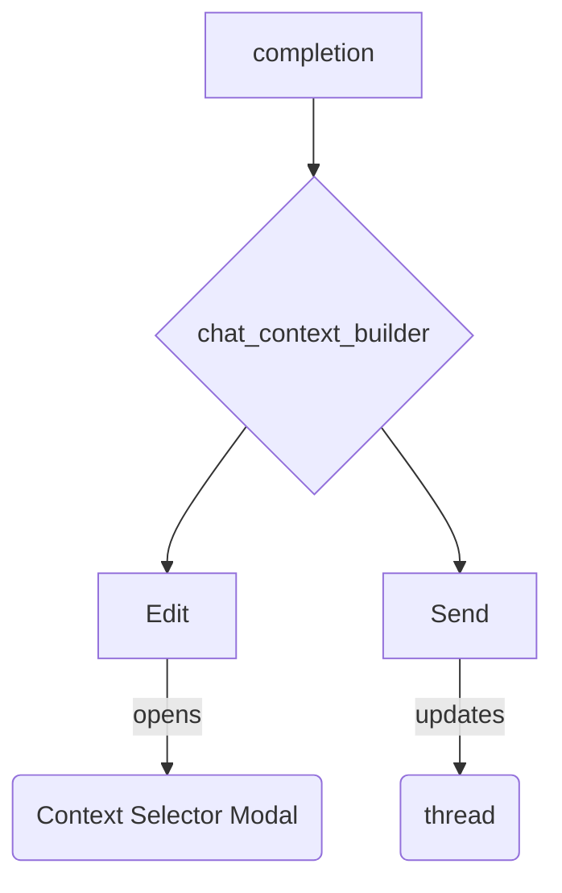

## Components API

### chat_context_builder.js

| Function | Description |
| --- | --- |
| `render(ctx, opts)` | Renders a context builder element derived from `smart-context-obsidian`. Adds chat controls like **Edit** and **Send** when supplied a `completion`. |
| `post_process(ctx, container, opts)` | Attaches chat-specific behaviour to the builder element. |

