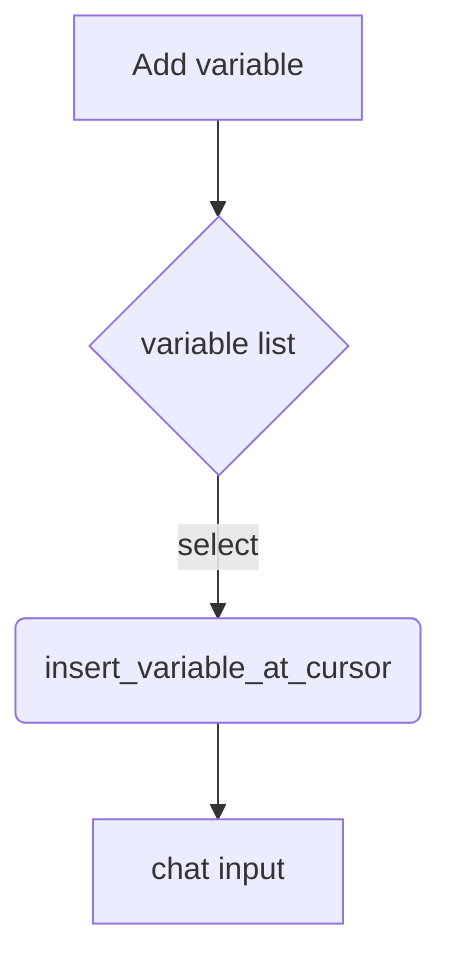

## Components API

### chat_context_builder.js

| Function | Description |
| --- | --- |
| `build_html(ctx, opts)` | Returns HTML markup for the context builder |
| `render(ctx, opts)` | Renders the markup and calls `post_process`. Adds chat controls like **Edit**, **Send**, and **Retrieve more**. |
| `post_process(ctx, container, opts)` | Attaches chat-specific behaviour to the builder element. |

### chat.js

| Function | Description |
| --- | --- |
| `rename_thread(collection, thread, new_name)` | Stores a friendly name in `data.name` and queues a save. |

### thread.js

| Function | Description |
| --- | --- |
| `insert_variable_at_cursor(el, variable)` | Inserts text at the user's caret position within the chat input. |
| `create_variable_menu(MenuClass, app, vars, on_select)` | Builds an Obsidian `Menu` listing completion variables. |

System prompt editor includes an **Add variable** button. Clicking it opens a native menu of `env.config.collections.smart_completions.completion_adapters.SmartCompletionVariableAdapter.available_vars` and inserts the chosen variable into the user message input.

