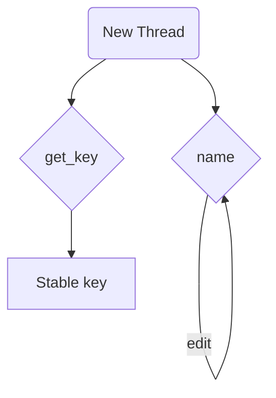

## Items API

### smart_chat_thread.js

| Property/Method | Description |
| --- | --- |
| `name` | Friendly thread label stored in `data.name`, falling back to `data.key`. |
| `get_key()` | Generates a stable key if not set and returns it. |
| `init_completion(data)` | Creates a new completion item for the thread. |

